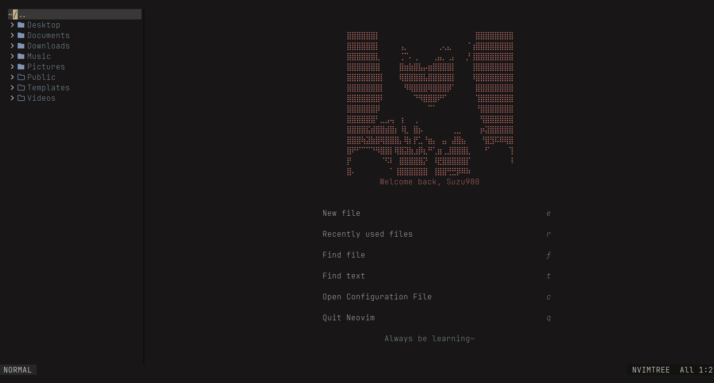

## Personal Neovim Configuration
This is my personal Neovim configuration and keybinds for personal use.
If you are new to Neovim, it is heavily encouraged to not copy my configuration files as these configurations are tailored to my personal workflow.


### Issues and Fixes
#### Clipboard is not working on linux
Remember to install xclip on x11 with Pacman
```shell
pacman -S xclip
```
For Wayland
```shell
pacman -S wl-clipboard 
```

#### C and C++ Compiler issues on Windows
Install gcc with Scoop
```shell
scoop install gcc
```

### Credits
Wallpaper source: [Violet Evergarden by Matsumayu](https://www.deviantart.com/matsumayu/art/Violet-from-Violet-Evergarden-737518940)
