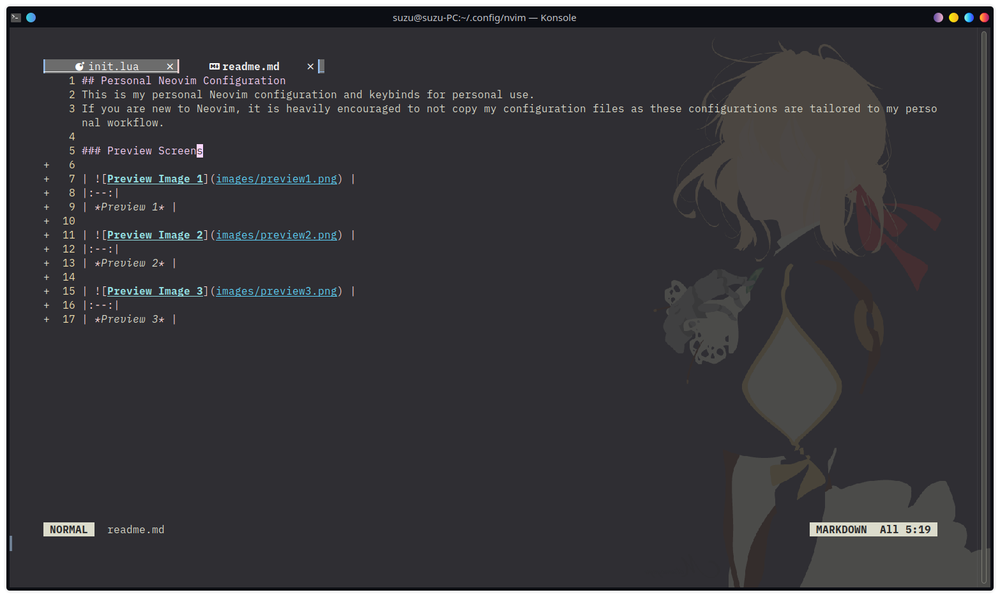
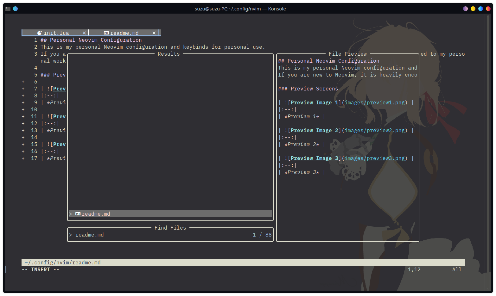

## Personal Neovim Configuration
This is my personal Neovim configuration and keybinds for personal use.
If you are new to Neovim, it is heavily encouraged to not copy my configuration files as these configurations are tailored to my personal workflow.

### Preview Screens

|  | 
|:--:| 
| *Preview 1* |

|  | 
|:--:| 
| *Preview 2* |

|  | 
|:--:| 
| *Preview 3* |
