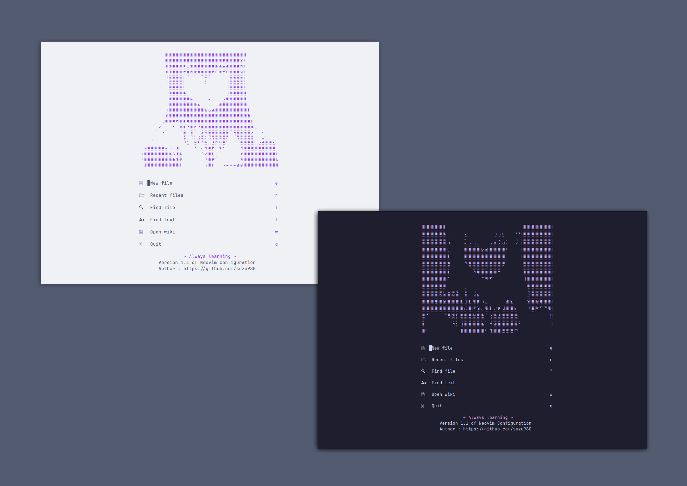

## Personal Neovim Configuration
This is my personal Neovim configuration and keybinds for personal use.
If you are new to Neovim, it is heavily encouraged to not copy my configuration files as these configurations are tailored to my personal workflow.  
Color Scheme is based off Catppuccin. [Original Github Repository is here](https://github.com/catppuccin/nvim)  

It is *strongly recommended* that you learn to make your own Neovim configuration instead of copying mine, as all keybinds and configurations are programmed to suit my own workflow.  

### Keybinds 
#### File Navigation
`Ctrl+n` - Toggle **Nvim-Tree**  
#### Dark Mode Switch
`<leader>mn` - To set theme to **Night Mode**  
`<leader>ml` - To set theme to **Light Mode**  
#### Writing
`<leader>go` - Launch **Goyo**  
`<leader>ce` - Enable **Conceal**  
`<leader>cd` - Disable **Conceal**  
`<leader>ll` - Toggle **Limelight**  
#### File Searching
`<leader>ff` - **Telescope** find files  
`<leader>fg` - **Telescope** live grep  
`<leader>fb` - **Telescope** show buffers  
`<leader>fh` - **Telescope** show help tags  
#### Switching Buffers
`tb` - **Buffer** previous  
`tt` - **Buffer** next  
`tq` - **Buffer** close  

### Issues and Fixes
#### Clipboard is not working on linux
Remember to install xclip on x11 with Pacman  
```shell
pacman -S xclip
```
For Wayland
```shell
pacman -S wl-clipboard 
```

#### C and C++ Compiler issues on Windows
Install gcc with Scoop  
```shell
scoop install gcc
```
#### grep not working
Install fd 
```shell
pacman -S fd
```
